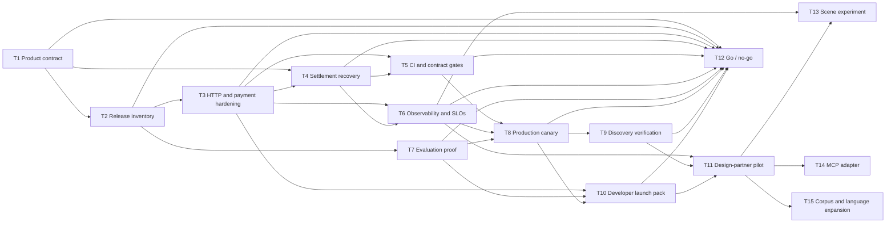

# Agent distribution context and go-live plan

Last updated: 2026-08-22

This document converts the user-provided research conversation about marketing
and distributing paid, agent-ready narration JSON over x402 into project
decisions and a dependency-ordered plan. The conversation is useful ideation,
not an authority: protocol mechanics and directory claims below are reconciled
with the current repository, the live production surface, and primary x402
sources.

## Product context

- Armin & Artur does **not** sell public-domain story text. The text remains
  free.
- It does **not** sell interactive or branching stories. The paid product is a
  complete, editorially curated, provider-neutral narration-direction artefact.
- The artefact supplies the direction that a media pipeline otherwise has to
  invent: reading policy, cast and speaker resolution, voice profiles, scene
  boundaries, silent stage directions and renderer guidance.
- The current corpus is German public-domain fairy tales. Later corpora may add
  other public-domain genres and languages, but every source and translation
  needs its own rights/provenance review.
- The economic buyer is a developer or operator of an automated media pipeline;
  the end listener is not the direct API customer.

The concise positioning statement is:

> Human-curated narration direction for agents that turn public-domain text
> into dependable spoken-media output.

## Initial customer profiles

The profiles are ordered by fit with the product that exists now.

1. **AI audio production and TTS pipelines** — audiobook, podcast, sleep-story
   and read-aloud products that need repeatable pacing and delivery direction
   without maintaining an editorial layer themselves.
2. **Automated audio/video production systems** — media pipelines that can map
   scenes and delivery guidance into narration, sound and visual timing.
3. **Virtual storytellers, reading products and connected devices** — products
   that need a premium read-aloud style while keeping one provider-neutral
   source of truth.

AI RPGs, autonomous game masters and branching narrative engines are not an
initial ICP. They may reuse parts of the format, but their need for state and
branching logic is different from this project's complete linear narration
artefacts.

## What was kept, reframed or rejected

| Research idea | Project disposition |
| --- | --- |
| Machine-readable catalogue, schema, OpenAPI and agent documentation | Keep. These are core distribution surfaces and mostly exist. |
| x402-native discovery | Keep. Bazaar metadata and facilitator settlement are the protocol-native path. |
| A free evaluation path and before/after proof | Keep as a pre-launch gap. The current ElevenLabs preview is deliberately DEV-only. |
| Launch with a small, reliable catalogue | Keep. Editorial readiness matters more than the raw count of files. |
| Stable, machine-readable failures | Keep. The current fail-closed statuses need a durable error contract and retry semantics. |
| Per-scene purchasing | Reframe as a post-launch experiment. The 742 existing scene boundaries make it feasible, but a second product surface is not required to validate whole-artefact demand. |
| MCP server | Reframe as a demand-led adapter. The HTTP API is already agent-usable; MCP is valuable only when a real client channel requires it. |
| One endpoint with `?lang=` for all translations | Reframe. Keep language in canonical metadata first; add filters or translation relationships only when multilingual artefacts exist. |
| “Agents will blacklist a broken service” | Reject as an unsupported universal claim. Design for immediate fallback and explicit retryability, then measure actual client behavior. |
| Fixed nanopayment prices suggested by the conversation | Reject as evidence. Keep the configured 0.01 USDC pilot price until usage data supports a pricing test. |
| Manual Agentic.Market submission | Corrected. Coinbase says Bazaar-indexed endpoints appear automatically after a qualifying CDP-facilitated payment; verification, not form submission, is the task. |
| Any directory is “the largest” | Do not claim. Bazaar, Agentic.Market, x402scan and 402 Index count different things. |

## Current baseline

Repository and production observations on 2026-08-21:

| Capability | State | Evidence and implication |
| --- | --- | --- |
| Canonical format and artefacts | Implemented, editorially mixed | 135 Story Reading Format 1.3 artefacts contain 742 scene boundaries. Three are `pilot_reviewed`, 130 are machine-validated pending editorial review and two are legacy examples pending review. |
| Free discovery catalogue | Implemented and live | `GET /api/v1/stories.json` advertises availability, language, schema and active payment parameters. |
| Free source/product boundary | Implemented | The public story response uses an allowlist and excludes the paid editorial fields. |
| Whole-artefact x402 v2 endpoint | Implemented and live for unsigned discovery | An unsigned production request returned `402`, Base mainnet USDC at 0.01, and a Bazaar extension. This does not prove successful paid settlement. |
| Machine documentation | Implemented and live | OpenAPI 3.1.1, JSON Schema, `llms.txt` and `llms-full.txt` are public. |
| Bazaar description | Implemented | The paid route advertises the dynamic story ID input and JSON output contract in `extensions.bazaar`. Its final facilitator listing is not yet verified. |
| Editorial launch inventory policy | Gap | The catalogue exposes artefacts regardless of `providerNotes.editorialStatus`; that conflicts with a product promise of editorial curation unless the launch set is filtered or reviewed. |
| Purchase-readiness semantics | Gap | `reading.available: true` currently means that a file maps to a Craft entry, not that the artefact is editorially approved or that payments can settle. Free discovery can also fail when payment configuration is invalid. |
| Scene semantics | Implemented for the current format; independent fit unverified | Scenes are editorial start anchors, participant lists and prose direction, not turn-by-turn dialogue segmentation. This is intentional for single-narrator production but needs an external renderer evaluation before “turnkey” claims. |
| Successful production purchase | Unverified | Local contract tests and a DEV browser test exist, but this audit did not spend funds or establish a completed production settlement. |
| Stable retryable error schema | Partial | `404`, `402` and fail-closed `503` behavior exists; non-payment failures do not yet have a versioned machine error body or explicit retry metadata. |
| Paid-response cache controls | Gap | The paid success and `402` challenge responses do not explicitly set `private, no-store` or the required `Vary` behavior. |
| Settlement recovery | Gap | There is no durable payment-attempt/receipt state machine or recovery path for the case where settlement succeeds but the artefact response is lost. |
| Payment integration and deployment gates | Partial | Challenge-shape tests exist, but there is no fake-facilitator suite for verify/settle outcomes, replay or ambiguous settlement. Production deployment does not run these tests or automated post-deploy probes. |
| Public evaluation proof | Gap | The free original text is public, but there is no public sample of the paid value layer or durable before/after integration example. |
| Funnel telemetry and service objectives | Gap/unknown | The repository does not document discovery-to-settlement funnel events, launch dashboards or an operational SLO. |
| Commercial contract | Gap | Paid-data usage rights, artefact revision/digest semantics, support, failed-delivery recovery and refund policy are not published as a machine-readable buyer contract. |
| Directory presence | Unverified | The endpoint has not been confirmed in the CDP Bazaar catalogue, Agentic.Market, x402scan or 402 Index. |
| Scene-level paid delivery | Not implemented; not a launch gate | Scene metadata exists inside each full artefact. There is no public scene purchase route or next-scene navigation contract. |
| MCP adapter | Not implemented; not a launch gate | Bazaar can describe HTTP endpoints without MCP. |
| Multilingual inventory | Future | The schema accepts language tags, but all 135 current artefacts are German. |

The production homepage currently returns `X-Robots-Tag: all`, while the JSON
API responses observed during this audit returned `X-Robots-Tag: none`.
`llms.txt` and `llms-full.txt` remain directly accessible. This does not block
facilitator-based Bazaar indexing, but the intended policy for general search
and agent crawlers should be decided and tested before broader promotion.

## Distribution strategy

### 1. Protocol-native discovery

Keep a valid Bazaar extension on every paid route. Complete and verify a real
payment through the chosen Bazaar-aware production facilitator, then confirm
the resource in that facilitator's discovery API. Bazaar is an open,
facilitator-specific discovery mechanism, not one global directory.

Agentic.Market consumes Bazaar data. Its documented Coinbase flow indexes a
service automatically when the CDP Facilitator processes a payment for an
endpoint with Bazaar metadata. There is no ordinary service-submission form;
use the [seller validator](https://agentic.market/validate) and verify the
eventual listing.

Add two independent discovery paths after the production contract is proven:

- [x402scan](https://www.x402scan.com/discovery), using its runtime probe and
  “Add Server” flow; and
- [402 Index](https://402index.io/about#for-api-providers), using Bazaar
  ingestion or its documented registration and domain-claim flow.

The [x402 ecosystem page](https://www.x402.org/ecosystem) is a curated showcase,
not a documented self-service listing target for an individual content API.

### 2. Developer enablement

Publish a minimal reference buyer that performs the actual flow: catalogue,
unsigned request, validation of the challenge, signed retry and verification
of `PAYMENT-RESPONSE`. Keep it copyable, but never ask a user to paste a private
key into a hosted form.

The launch pack should contain:

- a 60-second quickstart for an x402-capable client;
- one representative catalogue item and redacted response shapes;
- the OpenAPI and schema links already in production;
- a clear product boundary: free text versus paid editorial direction;
- renderer notes for a provider-neutral single-narrator workflow; and
- stable error/retry behavior.

### 3. Proof of value

Create one public, non-sensitive evaluation fixture from an editorially
approved artefact. It should let a developer compare raw text rendering with a
render informed by the direction layer. The fixture can be a deliberately
limited scene or a redacted/sample artefact; it does not require making the
first paid scene free across the whole catalogue.

Measure whether the proof leads to integration attempts and paid retries. Do
not assert that an agent will evaluate media quality or purchase autonomously
without an x402-aware client and a configured spend policy.

### 4. Human-to-developer distribution

Start with narrowly targeted design-partner outreach to the first ICP. The
message should sell saved editorial integration work and consistent output,
not “AI stories” or access to public-domain text. Use the reference buyer and
evaluation fixture as the call to action. GitHub examples, x402 community
channels and direct outreach create developer awareness; they are not
substitutes for machine discovery.

## Go-live work plan

Every task has an explicit dependency declaration. Tasks T13–T15 are
post-launch experiments and are not part of the initial go/no-go gate.

| ID | Task | depends_on | Acceptance evidence |
| --- | --- | --- | --- |
| T1 | Define the launch product and commercial contract | `[]` | The initial SKU is explicitly a whole, reviewed artefact at the configured pilot price. Sellable editorial statuses, revision/digest behavior, usage rights, support, failed-delivery recovery and refund policy are documented. Scene pricing remains a later experiment. |
| T2 | Enforce a truthful release inventory | `[T1]` | A release manifest or equivalent policy exposes only approved artefacts. Catalogue and paid routes publish distinct `artifactAvailable` and `purchaseAvailable` states plus editorial status, scene count, revision/digest, size and a machine-readable unavailable reason. Direct URLs cannot bypass the policy. Free discovery remains available when payment configuration is unhealthy. |
| T3 | Harden the public HTTP and payment contract | `[T2]` | OpenAPI and code define complete response schemas and a versioned error body with stable codes, retryability and `Retry-After`. Paid content and challenges use explicit `private, no-store` and correct `Vary` headers. Facilitator 4xx/5xx cases are classified correctly; correlation and bounded abuse controls are in place. |
| T4 | Add durable settlement and delivery recovery | `[T1, T3]` | A payment-attempt/receipt state machine keyed by a non-secret authorization fingerprint handles replay and ambiguous settlement, supports reconciliation, and lets a paid buyer recover an artefact when settlement succeeded but the response was lost. Blind settlement retries are not required. |
| T5 | Make contract and payment tests deployment gates | `[T3, T4]` | Fake-facilitator tests cover verify/settle success, rejection, malformed responses, timeouts, replay and recovery. OpenAPI/schema validation and the full artefact suite run before deployment; automated post-deploy probes verify discovery, challenge and cache behavior. |
| T6 | Add launch observability and service objectives | `[T3, T4]` | Aggregate events distinguish catalogue request, `402` challenge, signed retry, verification rejection, settlement success, recovery and facilitator failure. A dashboard reports conversion, latency and availability without logging secrets or full payment payloads; alerts and a reconciliation runbook exist. |
| T7 | Publish one evaluation fixture and proof | `[T2]` | An editorially approved, intentionally scoped sample plus a reproducible raw-versus-directed renderer comparison is public and linked from agent/developer documentation. At least one independent consumer validates that the scene-anchor format is usable as documented. |
| T8 | Run a controlled production canary | `[T5, T6, T7]` | A low-value mainnet canary proves challenge, signed retry, verification, settlement, receipt, content delivery, cache behavior and lost-response recovery. Invalid and facilitator-failure paths remain fail-closed. Record non-secret evidence and transaction references. |
| T9 | Verify machine discovery | `[T8]` | The live resource is visible in the chosen facilitator's Bazaar API and Agentic.Market. x402scan and 402 Index successfully probe or register it, with compatibility metadata added where their documented flows require it. Record URLs and timestamps; decide and test the API `X-Robots-Tag` policy. |
| T10 | Ship the developer launch pack | `[T3, T7, T8]` | A reference buyer and concise quickstart complete a canary-equivalent purchase without hidden manual steps. Documentation states client wallet/spend-policy requirements, product/license terms, recovery semantics and live contract links. |
| T11 | Run a design-partner pilot with the primary ICP | `[T6, T9, T10]` | Contact a small named cohort of audio/TTS pipeline developers, log qualified integration attempts and capture objections using a consistent interview/experiment template. |
| T12 | Make the initial go/no-go decision | `[T1, T2, T3, T4, T5, T6, T7, T8, T9, T10]` | Go only when the launch set and commercial contract are defensible, settlement and recovery are proven, discovery is verified, telemetry is visible and a new developer can reproduce the purchase. T11 may begin as a private pilot before broad announcement. |
| T13 | Test whole artefact versus scene-level delivery | `[T6, T11]` | Use observed payload, context and spend objections to decide whether to prototype `GET /api/v1/stories/{id}/scenes/{sceneId}/reading.json`. Define bundle semantics, pricing, next-scene navigation, recovery and paid-data leakage tests before implementation. |
| T14 | Add an MCP adapter only for a validated channel | `[T11]` | A design partner or measurable acquisition channel requires MCP; the adapter uses an x402-aware client/server path and publishes public server metadata to the MCP Registry when appropriate. |
| T15 | Expand corpus and languages | `[T11]` | Demand selects the next corpus/language. Each source and translation has documented provenance/rights, editorial QA, canonical language tags and discoverable catalogue metadata before sale. |

### Dependency graph

## Launch metrics

Track a small funnel rather than vanity traffic:

- catalogue readers that request a paid URL;
- `402` challenges that become signed retries;
- signed retries rejected by validation versus facilitator failure;
- successful settlements and repeat buyers;
- time from quickstart open to first successful integration;
- sample/proof usage that leads to a paid attempt; and
- qualified ICP conversations, integrations and repeat consumption.

The first pricing decision should be based on paid conversion, repeat use,
payload size and buyer objections. Do not infer demand for per-scene
nanopayments merely from technical feasibility.

## Primary references

- [x402 specification and official repository](https://github.com/x402-foundation/x402)
- [Official Bazaar discovery documentation](https://docs.x402.org/extensions/bazaar)
- [Coinbase Agentic.Market launch and automatic indexing flow](https://www.coinbase.com/developer-platform/discover/launches/agentic-market)
- [CDP list-x402-resources API](https://docs.cdp.coinbase.com/api-reference/v2/rest-api/x402-facilitator/list-x402-resources)
- [x402scan discovery and registration specification](https://github.com/Merit-Systems/x402scan/blob/main/docs/DISCOVERY.md)
- [402 Index provider instructions](https://402index.io/about#for-api-providers)
- [Official x402 MCP guide](https://docs.x402.org/guides/mcp-server-with-x402)
